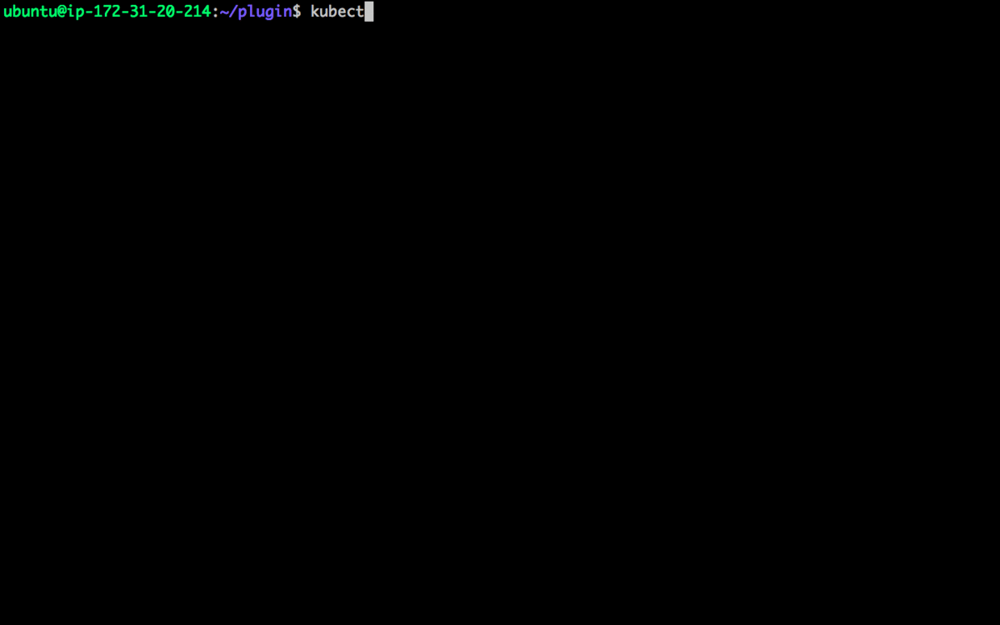
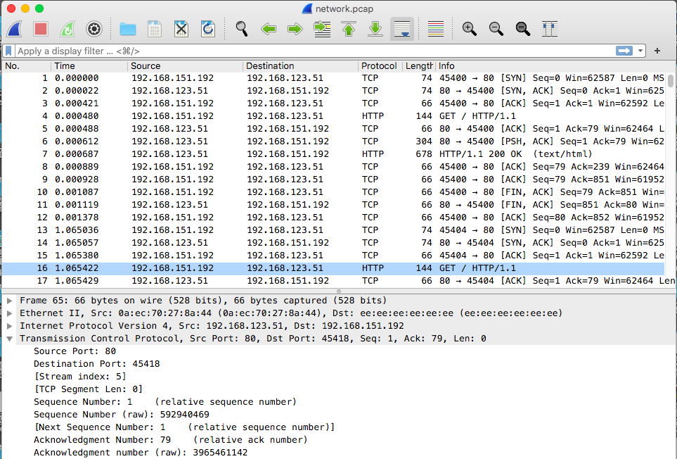

# Kubectl Tcpdump

That is a kubectl plugin which allows you to get pcap file output to watch network activity in pod level.You can easily connect your pods and execute TCPDUMP outputs without install anyof tool inside of the application pods.

## How you can use this ?
That's the simple usage shown at below;

```sh
kubectl tcpdump <POD_NAME> <PORT_TO_SNIFF> <NAMESPACE> <CONTAINER_NAME>
```
If you do not set any interface name the tcpdump command will try to sniff `lo` interface as default.

</img>

You can easily download pcap file and open it in WireShark easily.Pcap file is storing under the `/opt` directory with the `<POD_NAME>.pcap` prefix.

* Example wireshark output shown at below;
</img>

### How to install ?
...Coming soon

#### Caveats

* FeatureGates

Before you install please set those FeatureGates into the your `api-server`, `scheduler` `control-manager` and `kubelet` as well.
```
--feature-gates="EphemeralContainers=true"
```
On kubelet (worker nodes )
```
featureGates:
  EphemeralContainers: true
```

* Authentication & Authorization

This plugin uses client-certificate based authentiation currently, but in the future we will enable OICD, IAM and token based authentication options in there.


* Installation

<b> Notice: </b> 

Requirements;

You have to install `jq` and `yq` command into the local environment.This tools uses those commands while parsing them.

```

#!/bin/bash
git clone git@github.com:WoodProgrammer/k8s-tcpdumper.git 
sudo mkdir -p /usr/local/bin/k8s-tcpdumper/src

sudo mv k8s-tcpdumper/src/ephemeral_container.py /usr/local/bin/k8s-tcpdumper/src/
sudo mv k8s-tcpdumper/main.py /usr/local/bin/k8s-tcpdumper/main.py

sudo mv k8s-tcpdumper/plugin/kubectl-tcpdump /usr/local/bin/kubectl-tcpdump

```
### Wireshark

That plugin fetch the pcap output via tcpdump and routes them to the wireshark.Before you run that please be ensure wireshark installed properly on your terminal `PATH`.

Related links: 
* <a href="https://www.wireshark.org/download.html">WireShark Installation</a>


# TODO

* Dashboards
* stdin stdout controls
* Log Messages
